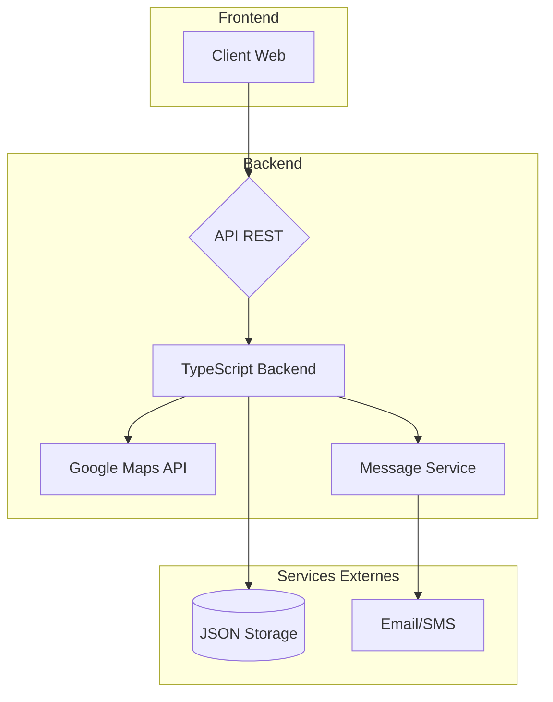

# TransCargo - Gestion de Cargaisons Maritime, Aérienne et Routière

## 📋 Résumé Exécutif

TransCargo est une application de gestion complète pour une entreprise de transport multi-modal (maritime, aérien, routier). L'application combine une architecture TypeScript côté serveur avec une interface utilisateur web moderne pour gérer l'ensemble du cycle de vie des cargaisons et colis.

## 🏗️ Architecture Globale



## 🎯 Fonctionnalités Principales

### 1. Gestion des Cargaisons
- Création de cargaisons par type de transport (maritime, aérien, routier)
- Suivi des états (En attente, En cours, Arrivé)
- Gestion des poids et capacités
- Calcul automatique des frais de transport

### 2. Gestion des Colis
- Enregistrement de colis avec détails expéditeur/destinataire
- Classification par type de produit (alimentaire, chimique, matériel)
- Suivi d'état (En attente, En cours, Arrivé, Récupéré, Perdu)
- Génération de reçus d'expédition

### 3. Contraintes Métier
- **Produits chimiques** : Uniquement transport maritime
- **Produits fragiles** : Interdits en transport maritime
- **Produits chimiques** : Interdits en transport aérien
- **Limite** : Maximum 10 produits par cargaison

### 4. Calcul des Tarifs

| Type Transport | Alimentaire | Chimique | Matériel |
|----------------|-------------|----------|----------|
| **Routier** | 100F/kg/km | ❌ | 200F/kg/km |
| **Maritime** | 50F/kg/km + 5000F | 500F/kg/toxicité + 10000F | 400F/kg/km |
| **Aérien** | 300F/kg/km | ❌ | 1000F/kg |

## 🧱 Structure du Code

### Backend (TypeScript/Node.js)

```
src/
├── Model/                 # Modèles de données (POO)
│   ├── Produit.ts         # Classe abstraite produit
│   ├── Alimentaire.ts     # Produits alimentaires
│   ├── Chimique.ts        # Produits chimiques
│   ├── Materiel.ts        # Classe abstraite matériel
│   ├── Fragile.ts         # Matériel fragile
│   ├── Incassable.ts      # Matériel incassable
│   ├── Cargaison.ts       # Classe abstraite cargaison
│   ├── Routiere.ts        # Transport routier
│   ├── Maritime.ts        # Transport maritime
│   └── Aerienne.ts        # Transport aérien
├── Services/              # Services métier
│   ├── CargaisonService.ts # Logique principale
│   └── GoogleMapsService.ts # Services de géolocalisation
├── Storage/               # Gestion du stockage
│   └── DataManager.ts      # Persistance JSON
└── server.ts              # Point d'entrée serveur
```

### Frontend (HTML/CSS/JavaScript)

```
public/
├── index.html             # Interface client (suivi)
├── admin.html             # Interface gestionnaire
├── app.js                 # Logique client
├── admin.js               # Logique admin
├── map-functions.js        # Fonctions cartographiques
└── styles.css             # Styles globaux
```

## 📊 Modèles de Données

### Cargaison
```typescript
class Cargaison {
  id: string
  numero: string
  poidsMax: number
  produits: Produit[]
  trajet: TrajetCoordinates
  distance: number
  etatAvancement: 'EN_ATTENTE' | 'EN_COURS' | 'ARRIVE' | 'RETARD'
  etatGlobal: 'OUVERT' | 'FERME'
  dateCreation: Date
  dateDepart?: Date
  dateArriveePrevu?: Date
  dateArriveeReelle?: Date
}
```

### Colis
```typescript
class Colis {
  id: string
  expediteur: ClientData
  destinataire: DestinataireData
  poids: number
  typeProduit: string
  typeCargaison: 'maritime' | 'aerienne' | 'routiere'
  prixCalcule: number
  prixFinal: number
  etat: 'EN_ATTENTE' | 'EN_COURS' | 'ARRIVE' | 'RECUPERE' | 'PERDU' | 'ARCHIVE' | 'ANNULE'
  cargaisonId: string
  dateCreation: Date
  dateArrivee?: Date
  codeDestinataire: string
}
```

## 🔧 API Endpoints

### Cargaisons
- `GET /api/cargaisons` - Liste toutes les cargaisons
- `POST /api/cargaisons` - Crée une nouvelle cargaison
- `GET /api/cargaisons/disponibles` - Liste les cargaisons ouvertes
- `POST /api/cargaisons/:id/close` - Ferme une cargaison
- `POST /api/cargaisons/:id/reopen` - Rouvre une cargaison
- `POST /api/cargaisons/:id/start` - Démarre une cargaison
- `POST /api/cargaisons/:id/arrive` - Marque une cargaison comme arrivée

### Colis
- `GET /api/colis` - Liste tous les colis
- `POST /api/colis` - Crée un nouveau colis
- `GET /api/colis/search` - Recherche un colis par code
- `GET /api/colis/track` - Suit un colis
- `GET /api/colis/:id/recu` - Génère un reçu
- `POST /api/colis/:id/recupere` - Marque un colis comme récupéré
- `POST /api/colis/:id/perdu` - Marque un colis comme perdu

### Statistiques
- `GET /api/statistiques` - Récupère les statistiques globales

## 🛡️ Sécurité et Validation

- Validation côté serveur complète
- Protection contre les injections de commande shell
- Validation des types TypeScript
- Gestion des erreurs centralisée

## 🎨 Interface Utilisateur

### Technologies Frontend
- **Tailwind CSS** pour le design
- **Feather Icons** pour les icônes
- **Leaflet.js** pour les cartes
- **Chart.js** pour les graphiques
- **JavaScript vanilla** pour l'interactivité

### Fonctionnalités UI
- Interface responsive mobile-first
- Design moderne avec gradient
- Interactions fluides
- Statistiques en temps réel
- Notifications toast
- Suivi géolocalisé avec Google Maps

## 🔄 Workflow Utilisateur

### Pour le Gestionnaire:
1. **Création de cargaison** : Sélection du type, lieux de départ/arrivée via carte
2. **Enregistrement de colis** : Saisie des informations expéditeur/destinataire
3. **Gestion des états** : Ouverture/fermeture/démarrage des cargaisons
4. **Suivi** : Visualisation des statistiques et états

### Pour le Client:
1. **Suivi de colis** : Saisie du code de suivi
2. **Consultation** : Visualisation de l'état et historique

## 📈 Performance et Scalabilité

### Optimisations Actuelles:
- Compilation TypeScript pour performance
- Stockage JSON optimisé
- Gestion d'erreurs centralisée
- Validation de données côté client et serveur

### Limitations:
- Stockage JSON (pas de base de données relationnelle)
- Pas d'authentification utilisateur complète
- Pas de mise à l'échelle horizontale

## 🚀 Déploiement

### Prérequis:
- Node.js 16+
- TypeScript installé globalement
- Serveur web Apache/Nginx
- PHP 7.4+ pour certaines fonctionnalités

### Installation:
```bash
npm install -g typescript @types/node
npx tsc
npm start
```

## 🧪 Tests

Les tests couvrent:
- Création des produits et cargaisons
- Validation des contraintes métier
- Calculs de frais
- Encapsulation (getters/setters)
- Gestion d'erreurs

Exécution: `node dist/test.js`

## 📝 Améliorations Futures

### Prioritaires:
1. Migration vers base de données (MySQL/PostgreSQL)
2. Authentification utilisateurs complète
3. API REST complète avec documentation Swagger
4. Export PDF des cargaisons et reçus

### Secondaires:
1. Notifications en temps réel (WebSockets)
2. Module de facturation avancé
3. Système de rôles et permissions
4. Internationalisation (i18n)

## 📞 Support

Pour toute question sur l'implémentation ou l'utilisation du système, référez-vous aux tests dans `src/test.ts` qui documentent tous les cas d'usage.